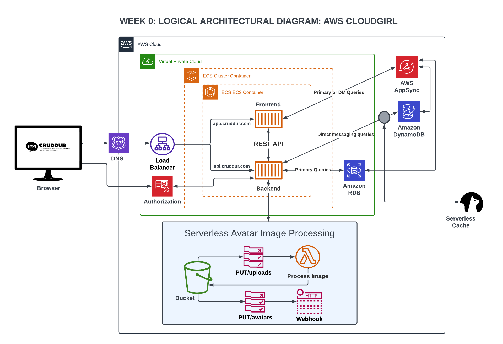

# Week 0 — Billing and Architecture

# Week 0 — Billing and Architecture

## Required Homework

### Conceptual Diagram

Reproduced the Conceptual Diagram in [Lucid](https://lucid.app/lucidchart/e36aa0ae-d715-4a15-aef9-c380b422ab40/edit?viewport_loc=-83%2C224%2C2368%2C1092%2C0_0&invitationId=inv_3651fdcf-a382-42b2-8b27-91db4dc6d9d7)

### Logical Architechtural Diagram

Reproduced the Logical Architechtural Diagram in [Lucid](https://lucid.app/lucidchart/38ab1af9-fbe4-456a-846e-db022d37aaa0/edit?view_items=jahxhQ.0VKvg&invitationId=inv_899f38d1-94ec-47d6-bc8c-2551a7769bd2)

### Installing CLI

Installed AWS CLI on Gitpod. 

Added credentials and ran the `aws sts get-caller-identity` command and it was working. 

Added the task script in the .yaml file. 

Next day I tried to start the environment and it wouldn't recognise my region no matter what I tried. 

I tried resetting the env vars by taking the keys etc out of the quotation marks. 

I tried `unset AWS_...` for each variable. 

Nothing. 

I tried `or var in AWS_ACCESS_KEY_ID AWS_SECRET_ACCESS_KEY AWS_DEFAULT_REGION AWS_REGION; do eval unset $var ; done`. 

Nothing. 

Each time I took the credentials off, fine but as soon as I added them back it would return error messages 

So I tried deleting the environment but the tasks script were still there. 

Cut an extremely long story short, I deleted everything github repository and everything and started again. 

Decided that as I have already got CLI on my macbook, I will add AWS CLI on my new windows laptop.

I followed the AWS document to [install AWS CLI on Windows]() and ran the `msiexec` command:

`
    msiexec.exe /i https://awscli.amazonaws.com/AWSCLIV2.msi
`
Checked the version by running `aws --version`

Ran `aws configure`

### Create an Admin User

### Use Cloudshell

### Create a Billing Alarm

### Create a Budget

# Homework Challenges
