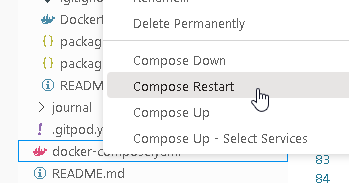
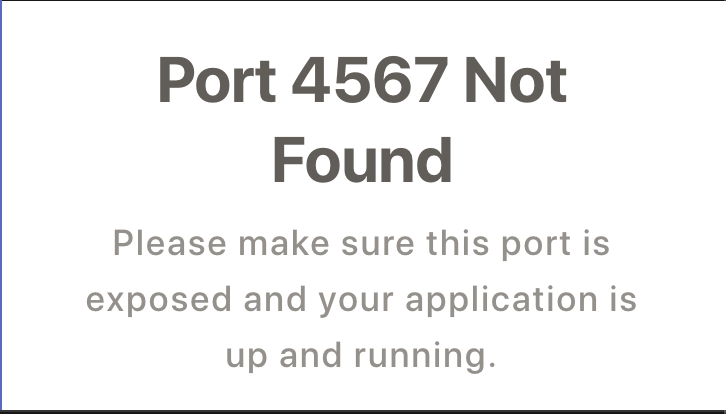
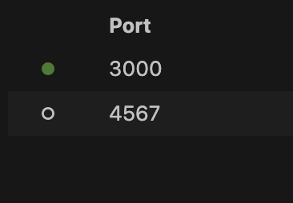

# Week 1 — App Containerization

## Create Dockerfile in `backend-flask`

Create `Dockerfile` using this code:

```FROM python:3.10-slim-buster

WORKDIR /backend-flask

COPY requirements.txt requirements.txt
RUN pip3 install -r requirements.txt

COPY . .

ENV FLASK_ENV=development

EXPOSE ${PORT}
CMD [ "python3", "-m" , "flask", "run", "--host=0.0.0.0", "--port=4567"]
````

 • open port `4567`

## Run Python

```cd backend-flask
export FRONTEND_URL="*"
export BACKEND_URL="*"
python3 -m flask run --host=0.0.0.0 --port=4567
```
 • click the link next to `4567`
 
 • add `/api/activities/home`at the end of the url to display json:
 
 ```json [
  {
    "created_at": "2023-02-24T00:04:09.277108+00:00",
    "expires_at": "2023-03-03T00:04:09.277108+00:00",
    "handle": "Andrew Brown",
    "likes_count": 5,
    "message": "Cloud is fun!",
    "replies": [
      {
        "created_at": "2023-02-24T00:04:09.277108+00:00",
        "handle": "Worf",
        "likes_count": 0,
        "message": "This post has no honor!",
        "replies_count": 0,
        "reply_to_activity_uuid": "68f126b0-1ceb-4a33-88be-d90fa7109eee",
        "reposts_count": 0,
        "uuid": "26e12864-1c26-5c3a-9658-97a10f8fea67"
      }
    ],
    "replies_count": 1,
    "reposts_count": 0,
    "uuid": "68f126b0-1ceb-4a33-88be-d90fa7109eee"
  },
  {
    "created_at": "2023-02-19T00:04:09.277108+00:00",
    "expires_at": "2023-03-07T00:04:09.277108+00:00",
    "handle": "Worf",
    "likes": 0,
    "message": "I am out of prune juice",
    "replies": [],
    "uuid": "66e12864-8c26-4c3a-9658-95a10f8fea67"
  },
  {
    "created_at": "2023-02-25T23:04:09.277108+00:00",
    "expires_at": "2023-02-26T12:04:09.277108+00:00",
    "handle": "Garek",
    "likes": 0,
    "message": "My dear doctor, I am just simple tailor",
    "replies": [],
    "uuid": "248959df-3079-4947-b847-9e0892d1bab4"
  }
]
````

## Build a Container:

```docker build -t  backend-flask ./backend-flask```

## Run the Container:

```docker run --rm -p 4567:4567 -it backend-flask
FRONTEND_URL="*" BACKEND_URL="*" docker run --rm -p 4567:4567 -it backend-flask
export FRONTEND_URL="*"
export BACKEND_URL="*"
docker run --rm -p 4567:4567 -it -e FRONTEND_URL='*' -e BACKEND_URL='*' backend-flask
docker run --rm -p 4567:4567 -it  -e FRONTEND_URL -e BACKEND_URL backend-flask
unset FRONTEND_URL="*"
unset BACKEND_URL="*"
````


## Troubleshooting

Left my laptop open and Gitpod shut down. When I logged back in and started everything up, the text was missing from the Cruddur app page:


.png)

Tried `compose restart`



Then I checked to see if the ports were on and open:

 

Then I ran `docker ps`to get the Container ID but because it was not running there was no ID so then I ran `docker ps -a` which shows all Containers regardless if they are on or not and used that to run `docker logs` to see what issues there were.

```Traceback (most recent call last):
  File "/usr/local/lib/python3.10/runpy.py", line 196, in _run_module_as_main
    return _run_code(code, main_globals, None,
  File "/usr/local/lib/python3.10/runpy.py", line 86, in _run_code
    exec(code, run_globals)
  File "/usr/local/lib/python3.10/site-packages/flask/main.py", line 3, in <module>
    main()
  File "/usr/local/lib/python3.10/site-packages/flask/cli.py", line 1050, in main
    cli.main()
  File "/usr/local/lib/python3.10/site-packages/click/core.py", line 1055, in main
    rv = self.invoke(ctx)
  File "/usr/local/lib/python3.10/site-packages/click/core.py", line 1657, in invoke
    return _process_result(sub_ctx.command.invoke(sub_ctx))
  File "/usr/local/lib/python3.10/site-packages/click/core.py", line 1404, in invoke
    return ctx.invoke(self.callback, ctx.params)
  File "/usr/local/lib/python3.10/site-packages/click/core.py", line 760, in invoke
    return __callback(*args, kwargs)
  File "/usr/local/lib/python3.10/site-packages/click/decorators.py", line 84, in new_func
    return ctx.invoke(f, obj, args, **kwargs)
  File "/usr/local/lib/python3.10/site-packages/click/core.py", line 760, in invoke
    return __callback(args, *kwargs)
  File "/usr/local/lib/python3.10/site-packages/flask/cli.py", line 911, in run_command
    raise e from None
  File "/usr/local/lib/python3.10/site-packages/flask/cli.py", line 897, in run_command
    app = info.load_app()
  File "/usr/local/lib/python3.10/site-packages/flask/cli.py", line 312, in load_app
    app = locate_app(import_name, None, raise_if_not_found=False)
  File "/usr/local/lib/python3.10/site-packages/flask/cli.py", line 218, in locate_app
    import(module_name)
  File "/backend-flask/app.py", line 7, in <module>
    from services.notifications_activities import
  File "/backend-flask/services/notifications_activities.py", line 5
    results = [{
IndentationError: unexpected indent
```

This indicated that I had an identation error in my code, which I found in line 4 in my `notifications_activities.py`file and I corrected that and it worked! :)

