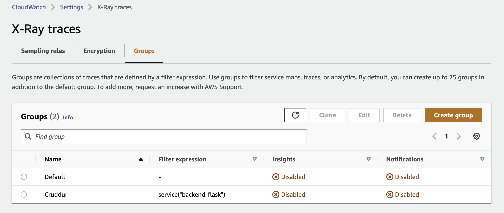
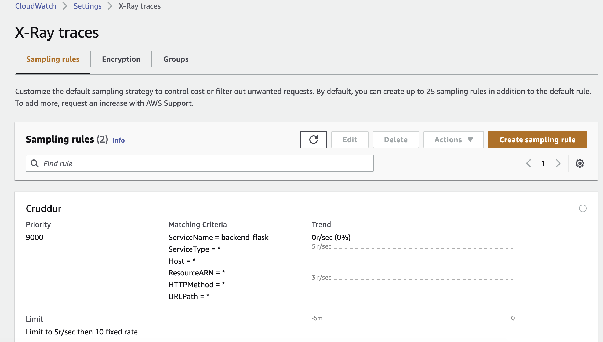

 # Week 2 — Distributed Tracing

 # Add `npm i` to `gitpod.yml`:
 
 ```yaml
 - name: react-js
    command: |
      cd /workspace/frontend-react-js
      npm i
  ```
 
 # AWS X-Ray

 • create an account: https://ui.honeycomb.io/ 
 
 • create an environment in Honeycomb and copy the api key and add in the Env Vars:

 ```bash
 export HONEYCOMB_API_KEY="f1OJ8uGau8KnatoEyMCuGE"
 gp env HONEYCOMB_API_KEY="f1OJ8uGau8KnatoEyMCuGE"
 export HONEYCOMB_SERVICE_NAME="Cruddur"
 gp env HONEYCOMB_SERVICE_NAME="Cruddur"
 ```
 ## Add Env Vars to `backend-flask` in ` docker-compose.yml`:

 ```yaml
 OTEL_SERVICE_NAME: "backend-flask"
 OTEL_EXPORTER_OTLP_ENDPOINT: "https://api.honeycomb.io"
 OTEL_EXPORTER_OTLP_HEADERS: "x-honeycomb-team=${HONEYCOMB_API_KEY}"
 ```
 
 ## Add files to ` requirements.txt`:
 
 ```
 opentelemetry-api 
 opentelemetry-sdk 
 opentelemetry-exporter-otlp-proto-http 
 opentelemetry-instrumentation-flask 
 opentelemetry-instrumentation-requests
 ```
 ## Install files:
 
 ```bash
 pip install -r requirements.txt
 ```
 
 ## I got back an error:
 
 ```bash
 ERROR: Could not open requirements file: [Errno 2] No such file or directory: 'requirements.txt'
 ```
 
 ## I was in the wrong directory:
 
 `cd backend-flask`
 
 ## Then ran `pip install -r requirements.txt` again.
 
 ## Add lines to `app.py`:
 
 ```python
 from opentelemetry import trace
 from opentelemetry.instrumentation.flask import FlaskInstrumentor
 from opentelemetry.instrumentation.requests import RequestsInstrumentor
 from opentelemetry.exporter.otlp.proto.http.trace_exporter import OTLPSpanExporter
 from opentelemetry.sdk.trace import TracerProvider
 from opentelemetry.sdk.trace.export import BatchSpanProcessor
 ```

 ## Then add:
 
 ```python
 # Initialize tracing and an exporter that can send data to Honeycomb
 provider = TracerProvider()
 processor = BatchSpanProcessor(OTLPSpanExporter())
 provider.add_span_processor(processor)
 trace.set_tracer_provider(provider)
 tracer = trace.get_tracer(__name__)
 ```

 ## Then lastly add:
 
 ```python
# Initialize automatic instrumentation with Flask
app = Flask(__name__)
FlaskInstrumentor().instrument_app(app)
RequestsInstrumentor().instrument()
```
 ## Note:
 
 Added what seems like missing code (maybe I deleted it):
 
 ```python
 simple_processor = SimpleSpanProcessor(ConsoleSpanExporter())
provider.add_span_processor(simple_processor)
```

Documentation: https://docs.honeycomb.io/getting-data-in/opentelemetry/python/

# Add code to make ports open:

```yaml
ports:
  - name: frontend
    port: 3000
    onOpen: open-browser
    visibility: public
  - name: backend
    port: 4567
    visibility: public
  - name: xray-daemon
    port: 2000
    visibility: public
```

# Make `aws/json/xray.json` file:

```json
{
  "SamplingRule": {
      "RuleName": "Cruddur",
      "ResourceARN": "*",
      "Priority": 9000,
      "FixedRate": 0.1,
      "ReservoirSize": 5,
      "ServiceName": "backend-flask",
      "ServiceType": "*",
      "Host": "*",
      "HTTPMethod": "*",
      "URLPath": "*",
      "Version": 1
  }
}
```

# Add to terminal:

```bash
FLASK_ADDRESS="https://4567-${GITPOD_WORKSPACE_ID}.${GITPOD_WORKSPACE_CLUSTER_HOST}"
aws xray create-group \
   --group-name "Cruddur" \
   --filter-expression "service(\"$FLASK_ADDRESS\") {fault OR error}"
```
 
 ## Got an error so added it seperately:
 
 ```bash
 FLASK_ADDRESS="https://4567-${GITPOD_WORKSPACE_ID}.${GITPOD_WORKSPACE_CLUSTER_HOST}"
 ```
 
 ```bash
 aws xray create-group --group-name "Cruddur" --filter-expression "service(\"backend-flask\")"
 ```
 
## Which returned back:

```json
{
    "Group": {
        "GroupName": "Cruddur",
        "GroupARN": "arn:aws:xray:us-east-1:************:group/Cruddur/************************************************",
        "FilterExpression": "service(\"backend-flask\")",
        "InsightsConfiguration": {
            "InsightsEnabled": false,
            "NotificationsEnabled": false
        }
    }
}
```

# Check AWS console under `cloudwatch > settings > X-Ray traces > Groups`:



## Enter on the terminal:

```bash
aws xray create-sampling-rule --cli-input-json file://aws/json/xray.json
```

## Which returned:

```json
{
    "SamplingRuleRecord": {
        "SamplingRule": {
            "RuleName": "Cruddur",
            "RuleARN": "arn:aws:xray:us-east-1:************:sampling-rule/Cruddur",
            "ResourceARN": "*",
            "Priority": 9000,
            "FixedRate": 0.1,
            "ReservoirSize": 5,
            "ServiceName": "backend-flask",
            "ServiceType": "*",
            "Host": "*",
            "HTTPMethod": "*",
            "URLPath": "*",
            "Version": 1,
            "Attributes": {}
        },
        "CreatedAt": "2023-03-09T23:16:14+00:00",
        "ModifiedAt": "2023-03-09T23:16:14+00:00"
    }
}
```

## Rule created in `cloudwatch > settings > X-Ray traces > Sampling Groups`:



